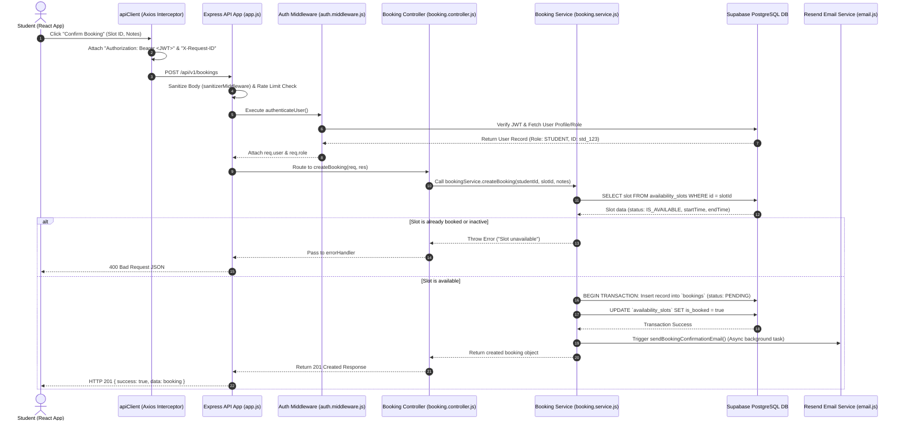

# 02. System Architecture & Component Topology

## 1. High-Level Architectural Pattern

NEXORA adheres to a **Decoupled Client-Server Tiered Architecture** built on the **Layered Monolith (Modular Monolith)** pattern for the backend and a **Single Page Application (SPA)** architecture for the frontend.

```
┌────────────────────────────────────────────────────────────────────────────────────────┐
│                                   CLIENT LAYER (Vercel)                                │
│  React 18 SPA + Vite + TailwindCSS + React Router v6 + Axios (`apiClient.js`)           │
└──────────────────────────────────────────┬─────────────────────────────────────────────┘
                                           │
                                     HTTPS │ JWT / JSON
                                           ▼
┌────────────────────────────────────────────────────────────────────────────────────────┐
│                                   API GATEWAY / REST API                               │
│                      Node.js (v18+) + Express.js 4 REST Server (Render)                │
├────────────────────────────────────────────────────────────────────────────────────────┤
│ MIDDLEWARE PIPELINE:                                                                   │
│ • Compression (`compression`)           • Helmet Security Headers (`helmet`)           │
│ • Correlation ID (`requestTrace.js`)    • Global Sanitizer (`sanitizer.js`)            │
│ • CORS Controls (`corsOptions`)         • Rate Limiters (`rateLimit`)                  │
│ • JWT Authentication (`auth.js`)        • Role-Based Access (`role.js`)                 │
├────────────────────────────────────────────────────────────────────────────────────────┤
│ CONTROLLER LAYER:                                                                      │
│ Auth | Student | Mentor | Availability | Booking | Notification | Admin | Health       │
├────────────────────────────────────────────────────────────────────────────────────────┤
│ SERVICE / DOMAIN LAYER:                                                                │
│ Business Rules | Validation (Zod) | Data Aggregation | Error Formatting                │
└──────────────────────┬──────────────────────────────────────────┬──────────────────────┘
                       │                                          │
             Supabase  │ PostgreSQL                               │ Transactional Email
             Client    │ Protocol                                 │ REST API
                       ▼                                          ▼
┌────────────────────────────────────────┐      ┌────────────────────────────────────────┐
│         DATA LAYER (Supabase)          │      │       NOTIFICATION PROVIDER            │
│ PostgreSQL 15 Engine + Auth Engine     │      │ Resend API (`email.js`)                │
│ Row Level Security (RLS) Policies      │      │ Async HTML Email Delivery Engine       │
└────────────────────────────────────────┘      └────────────────────────────────────────┘
```

---

## 2. Component Topology & Multi-Tier Breakdown

### A. Presentation Tier (Frontend Client)
- **Host Infrastructure:** Vercel (Edge CDN global distribution).
- **Core Framework:** React 18 using functional components, Hooks, and HTML5 semantic markup.
- **Build Engine:** Vite 5 for fast ESM bundling, hot module replacement (HMR), and code splitting.
- **Styling Architecture:** Tailwind CSS 3 utility classes integrated with custom design tokens in [tokens.css](file:///c:/Users/itzza/OneDrive/Desktop/NEXORA/client/src/styles/tokens.css) and animation primitives in [motion.js](file:///c:/Users/itzza/OneDrive/Desktop/NEXORA/client/src/styles/motion.js).
- **HTTP Transport Client:** Axios instance [apiClient.js](file:///c:/Users/itzza/OneDrive/Desktop/NEXORA/client/src/services/apiClient.js) configured with request/response interceptors, automatic JWT bearer token injection via [authStorage.js](file:///c:/Users/itzza/OneDrive/Desktop/NEXORA/client/src/utils/authStorage.js), auto-logout on `401 Unauthorized`, and error response normalization.

### B. Application Tier (Backend Express Server)
- **Host Infrastructure:** Render (Linux Node.js Web Service execution environment).
- **Core Runtime:** Node.js v18.x running Express 4.x application server instantiated in [app.js](file:///c:/Users/itzza/OneDrive/Desktop/NEXORA/server/src/app.js) and bound to a TCP socket in [server.js](file:///c:/Users/itzza/OneDrive/Desktop/NEXORA/server/src/server.js).
- **Layered Controller-Service Pattern:** Strict separation between HTTP handling ([controllers/](file:///c:/Users/itzza/OneDrive/Desktop/NEXORA/server/src/controllers)), business operations ([services/](file:///c:/Users/itzza/OneDrive/Desktop/NEXORA/server/src/services)), and input validation schemas ([validators/](file:///c:/Users/itzza/OneDrive/Desktop/NEXORA/server/src/validators)).
- **Middleware Pipeline:**
  1. Startup Validation: [env.validator.js](file:///c:/Users/itzza/OneDrive/Desktop/NEXORA/server/src/utils/env.validator.js) enforces presence of critical secrets on server bootstrap.
  2. Telemetry & Security: [requestTrace.middleware.js](file:///c:/Users/itzza/OneDrive/Desktop/NEXORA/server/src/middleware/requestTrace.middleware.js) assigns a unique `X-Request-ID` UUID header to every incoming HTTP request. Helmet sets security headers. `compression()` Gzip-compresses HTTP response bodies.
  3. Sanitization & Limiting: Express JSON body parser followed by [sanitizer.js](file:///c:/Users/itzza/OneDrive/Desktop/NEXORA/server/src/utils/sanitizer.js) stripping malicious script tags to prevent stored/reflected XSS. `express-rate-limit` guards against brute-force attacks on `/api/v1/auth` (20 req/15 min) and general endpoints (200 req/15 min).
  4. Authentication & RBAC: [auth.middleware.js](file:///c:/Users/itzza/OneDrive/Desktop/NEXORA/server/src/middleware/auth.middleware.js) extracts and verifies the Supabase Bearer token; [role.middleware.js](file:///c:/Users/itzza/OneDrive/Desktop/NEXORA/server/src/middleware/role.middleware.js) enforces authorization boundaries (`STUDENT`, `MENTOR`, `ADMIN`).
  5. Error Handling: Centralized [errorHandler.middleware.js](file:///c:/Users/itzza/OneDrive/Desktop/NEXORA/server/src/middleware/errorHandler.middleware.js) catches uncaught errors, formats structured JSON responses, and logs errors via [logger.js](file:///c:/Users/itzza/OneDrive/Desktop/NEXORA/server/src/utils/logger.js).

### C. Data & Auth Tier (Supabase PostgreSQL Engine)
- **Host Infrastructure:** Supabase Managed Cloud Postgres Instance.
- **Relational Storage:** PostgreSQL 15 instance storing `users`, `student_profiles`, `mentor_profiles`, `availability_slots`, `bookings`, and `notifications`.
- **Row Level Security (RLS):** Policies defined in `server/database/migrations/002_enable_rls.sql` restrict direct client database queries while the backend server bypasses RLS using `SUPABASE_SERVICE_ROLE_KEY` instantiated in [supabase.js](file:///c:/Users/itzza/OneDrive/Desktop/NEXORA/server/src/config/supabase.js).

### D. Communication Tier (Resend Email API)
- **SDK & Provider:** Resend Node.js SDK wrapped in [email.js](file:///c:/Users/itzza/OneDrive/Desktop/NEXORA/server/src/utils/email.js).
- **Asynchronous Execution:** Fired non-blockingly from service layer handlers (e.g. `booking.service.js`, `admin.service.js`) to prevent blocking API request-response cycles.

---

## 3. End-to-End Request Lifecycle & Sequence Flow

Below is the complete trace of a typical transactional operation — a **Student Booking a Mentor Slot**:



---

## 4. Key Architectural Design Decisions & Trade-Offs

1. **Bypass RLS in Express Backend via Service Role Key:**
   - *Rationale:* Business logic validations (such as overlapping slot checks and admin verification rules) require complex multi-table queries and transactional multi-step updates. Performing this in Express services provides centralized logic, easier debugging, and rich error handling compared to pure PostgreSQL stored procedures or client-side RLS rules.
2. **Axios Centralized Interceptor Strategy:**
   - *Rationale:* Encapsulating token retrieval, session expiration catching (`nexora:auth-expired` custom DOM event), and request ID injection inside `apiClient.js` prevents code duplication across custom hooks and UI pages.
3. **Decoupled Async Email Notification Dispatch:**
   - *Rationale:* Email delivery APIs can introduce 500ms–2000ms latency. The backend invokes `sendEmail()` asynchronously in a fire-and-forget pattern inside try-catch blocks so an email delivery issue never fails a database state commit or blocks user response times.
4. **Vite SPA over SSR Framework (Next.js):**
   - *Rationale:* NEXORA is an interactive dashboard application requiring high client-side state responsiveness after authentication rather than heavy public content indexing. Vite SPA offers fast build times, simple deployment to Vercel, and zero SSR hydration mismatch risks.
