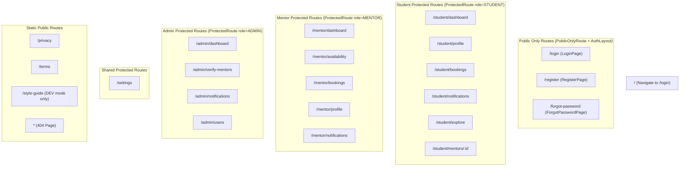

# 03. Frontend Architecture & Client Deep-Dive

## 1. Architectural Overview & Tech Stack

The NEXORA frontend is built as a single-page application (SPA) leveraging **React 18**, **Vite 5**, **React Router v6**, **Tailwind CSS 3**, and **Framer Motion**.

### Core Technical Specs:
- **Framework:** React 18 (Functional Components, Hooks, Context API, Code-Splitting with `React.lazy` and `Suspense`).
- **Build & Dev Tooling:** Vite 5 with `@vitejs/plugin-react` ESM bundling.
- **State Management:** Dual Context system ([AuthContext.jsx](file:///c:/Users/itzza/OneDrive/Desktop/NEXORA/client/src/context/AuthContext.jsx) for session state and user metadata; [ThemeContext.jsx](file:///c:/Users/itzza/OneDrive/Desktop/NEXORA/client/src/context/ThemeContext.jsx) for dark/light mode toggle).
- **Styling Architecture:** Utility-first CSS via Tailwind CSS 3, enhanced with custom CSS variable design tokens ([tokens.css](file:///c:/Users/itzza/OneDrive/Desktop/NEXORA/client/src/styles/tokens.css)) and Framer Motion variants ([motion.js](file:///c:/Users/itzza/OneDrive/Desktop/NEXORA/client/src/styles/motion.js)).
- **HTTP Transport:** Custom Axios wrapper ([apiClient.js](file:///c:/Users/itzza/OneDrive/Desktop/NEXORA/client/src/services/apiClient.js)) with request/response interceptors.

---

## 2. Directory Structure & Layout Hierarchy

```
client/src/
├── assets/                 # Brand assets & static media
├── components/             # UI components
│   ├── bookings/           # Slot booking modal & cards
│   ├── notifications/      # Notification cards, filters, skeletons
│   ├── profile/            # Avatar selection & profile helpers
│   ├── ui/                 # Reusable atomic UI (Button, Drawer, FormField, Modal, etc.)
│   ├── Navbar.jsx          # Top navigation bar
│   └── Sidebar.jsx         # Sidebar navigation with role-based items
├── constants/              # System constants (USER_ROLES, app config, navigation items)
├── context/                # Global contexts (AuthContext, ThemeContext)
├── hooks/                  # Custom React domain hooks (13 total)
├── layouts/                # Wrapper layouts (AuthLayout, DashboardLayout)
├── pages/                  # Page-level route views (Student, Mentor, Admin, Shared, Auth)
├── routes/                 # Routing engine (AppRoutes, ProtectedRoute, PublicOnlyRoute)
├── services/               # API service wrappers (Axios calls to Express backend)
├── styles/                 # Global styles, Tailwind directives, tokens, motions
└── utils/                  # Helper utilities (authStorage, cn, zodForm)
```

---

## 3. Global Contexts & State Management

### A. AuthContext (`client/src/context/AuthContext.jsx`)
- **Purpose:** Manages authentication lifecycle, active user session object, user role (`STUDENT`, `MENTOR`, `ADMIN`), profile data, and token sync with `localStorage`.
- **State Properties:**
  - `user`: Object | null — Active user credentials (ID, email, role, full_name, avatar_url, etc.).
  - `loading`: Boolean — Initial application session hydration indicator.
  - `error`: String | null — Session restoration or auth operation error message.
- **Exported Actions:** `login(email, password)`, `register(payload)`, `logout()`, `refreshProfile()`.
- **Session Expiration Event:** Subscribes to custom DOM event `nexora:auth-expired` dispatched by `apiClient.js` when an HTTP 401 is received. Upon trigger, automatically clears `authStorage` and resets user state to null.

### B. ThemeContext (`client/src/context/ThemeContext.jsx`)
- **Purpose:** Manages dark/light theme state across the entire document node.
- **Persistence:** Stores theme choice (`dark` or `light`) in `localStorage.getItem("nexora-theme")`.
- **DOM Injection:** Synchronizes `document.documentElement.classList.add('dark')` or `.remove('dark')`. Includes automatic fallback to system color scheme (`window.matchMedia('(prefers-color-scheme: dark)')`).

---

## 4. Routing Architecture & Route Guards

Client-side routing is declared in [AppRoutes.jsx](file:///c:/Users/itzza/OneDrive/Desktop/NEXORA/client/src/routes/AppRoutes.jsx) wrapped in Framer Motion `<AnimatePresence>` in [App.jsx](file:///c:/Users/itzza/OneDrive/Desktop/NEXORA/client/src/App.jsx).



### Route Protection Mechanisms:
1. **`PublicOnlyRoute.jsx`:** Guards `/login` and `/register`. If user is authenticated, redirects them immediately to their role-specific dashboard (`/student/dashboard`, `/mentor/dashboard`, `/admin/dashboard`).
2. **`ProtectedRoute.jsx`:** Checks if user is authenticated. If not authenticated, redirects to `/login`. If `allowedRoles` prop is provided (e.g. `[USER_ROLES.MENTOR]`), checks if `user.role` matches. If role mismatch occurs, redirects to the user's appropriate default home route.
3. **`LazyRoute` Wrapper:** Encapsulates dashboard pages using `React.lazy()` dynamic imports, displaying a custom `<RouteFallback>` with skeleton screens (`Skeleton.jsx`) while chunk loading.

---

## 5. UI/UX System & Design Tokens

### Color Palette & Design Tokens (`client/src/styles/tokens.css`)
NEXORA utilizes a dark-first color space defined with CSS custom properties:
- `--bg-primary`: Deep midnight dark (`#0B0F17` / HSL `222 47% 7%`).
- `--bg-secondary`: Surface card background (`#111827` / HSL `217 33% 11%`).
- `--accent-primary`: Vibrant indigo/violet gradient (`#6366F1` to `#8B5CF6`).
- `--accent-emerald`: Success indicator (`#10B981`).
- `--accent-amber`: Warning & pending indicator (`#F59E0B`).
- `--accent-rose`: Destructive action indicator (`#F43F5E`).

### Animations & Framer Motion (`client/src/styles/motion.js`)
Centralized animation variants provide consistent page transitions and interactive micro-animations:
- `pageVariants`: Fades and slides routes in (`opacity: 0, y: 15` -> `opacity: 1, y: 0`).
- `staggerContainer`: Staggers children list components by 0.05s intervals.
- `fadeInUp` / `scaleIn`: Micro-interaction variants for modals, drawers, and buttons.
