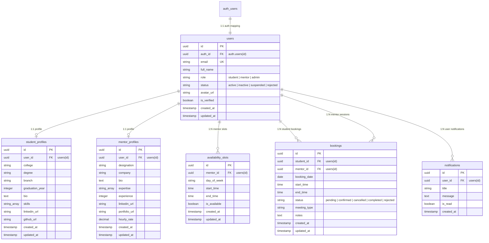

# 05. Database Architecture & Schema Reference

## 1. Relational Entity-Relationship Model (ER Diagram)

NEXORA relies on a normalized **PostgreSQL 15** relational schema hosted within **Supabase**. The database enforces strict referential integrity, cascading deletions, unique constraints, and Row Level Security (RLS).

---

## 2. Table Specifications & Data Dictionaries

### A. Table: `public.users`
Primary store for identity profiles extending `auth.users`.
- `id` (UUID, Primary Key, `gen_random_uuid()`): Unique application user ID.
- `auth_id` (UUID, Foreign Key -> `auth.users(id)` ON DELETE CASCADE, Unique): Link to Supabase Auth.
- `email` (TEXT, Unique, NOT NULL): Primary user email.
- `full_name` (TEXT, NOT NULL): Display name.
- `role` (TEXT, NOT NULL, CHECK in `'student', 'mentor', 'admin'`): Platform role.
- `status` (TEXT, NOT NULL, DEFAULT `'active'`, CHECK in `'active', 'inactive', 'suspended', 'rejected'`): Account status (updated via migration 003).
- `avatar_url` (TEXT): Profile photo URI.
- `is_verified` (BOOLEAN, NOT NULL, DEFAULT `FALSE`): Mentor verification status set by Admin.
- `created_at`, `updated_at` (TIMESTAMPTZ, NOT NULL, DEFAULT `NOW()`).

**Indexes:**
- `idx_users_auth_id` on `public.users(auth_id)`
- `idx_users_email` on `public.users(email)`
- `idx_users_role` on `public.users(role)`
- `idx_users_status` on `public.users(status)`

**Triggers:**
- `trigger_users_updated_at`: `BEFORE UPDATE` calls PL/pgSQL function `update_updated_at_column()` to automatically set `updated_at = NOW()`.

---

### B. Table: `public.student_profiles`
Stores academic background and technical interests of student users.
- `id` (UUID, Primary Key, `gen_random_uuid()`).
- `user_id` (UUID, Foreign Key -> `public.users(id)` ON DELETE CASCADE, Unique).
- `college` (TEXT, NOT NULL): University or institution name.
- `degree` (TEXT, NOT NULL): e.g. "Bachelor of Technology".
- `branch` (TEXT, NOT NULL): e.g. "Computer Science Engineering".
- `graduation_year` (INTEGER, NOT NULL): Expected graduation year.
- `bio` (TEXT): Short professional biography.
- `skills` (TEXT[] / Array of Strings): Technical skill tags (e.g., `["React", "Python"]`).
- `linkedin_url`, `github_url` (TEXT): External profile links.
- `created_at`, `updated_at` (TIMESTAMPTZ).

---

### C. Table: `public.mentor_profiles`
Stores professional experience, industry credentials, and hourly rates for mentors.
- `id` (UUID, Primary Key, `gen_random_uuid()`).
- `user_id` (UUID, Foreign Key -> `public.users(id)` ON DELETE CASCADE, Unique).
- `designation` (TEXT, NOT NULL): e.g. "Staff Software Engineer".
- `company` (TEXT, NOT NULL): e.g. "Google Cloud".
- `bio` (TEXT, NOT NULL): Detailed mentor bio.
- `expertise` (TEXT[], NOT NULL): Specialized domains (e.g. `["System Design", "Node.js"]`).
- `experience` (INTEGER, NOT NULL): Years of industry experience.
- `linkedin_url`, `portfolio_url` (TEXT): Verified profile links.
- `hourly_rate` (NUMERIC(10,2), DEFAULT `0.00`): Session compensation rate.
- `created_at`, `updated_at` (TIMESTAMPTZ).

---

### D. Table: `public.availability_slots`
Declares mentor slot windows for session booking.
- `id` (UUID, Primary Key, `gen_random_uuid()`).
- `mentor_id` (UUID, Foreign Key -> `public.users(id)` ON DELETE CASCADE).
- `day_of_week` (TEXT, NOT NULL): Day of week string (e.g., `'Monday'`, `'Tuesday'`).
- `start_time` (TIME, NOT NULL): Slot window start time (e.g., `'10:00:00'`).
- `end_time` (TIME, NOT NULL): Slot window end time (e.g., `'11:00:00'`).
- `is_available` (BOOLEAN, DEFAULT `TRUE`): Flag indicating if slot is open.
- **Unique Constraint:** `(mentor_id, day_of_week, start_time)` prevents overlapping duplicate slot entries for the same mentor.

---

### E. Table: `public.bookings`
Stores session bookings created by students with mentors.
- `id` (UUID, Primary Key, `gen_random_uuid()`).
- `student_id` (UUID, Foreign Key -> `public.users(id)` ON DELETE CASCADE).
- `mentor_id` (UUID, Foreign Key -> `public.users(id)` ON DELETE CASCADE).
- `booking_date` (DATE, NOT NULL): Session date.
- `start_time`, `end_time` (TIME, NOT NULL): Session timing.
- `status` (TEXT, NOT NULL, DEFAULT `'pending'`, CHECK in `'pending', 'confirmed', 'cancelled', 'completed', 'rejected'`).
- `meeting_type` (TEXT, DEFAULT `'Virtual Google Meet'`).
- `notes` (TEXT): Student goals or session agenda notes.
- `created_at`, `updated_at` (TIMESTAMPTZ).

---

### F. Table: `public.notifications`
Stores system and transactional alerts for users.
- `id` (UUID, Primary Key, `gen_random_uuid()`).
- `user_id` (UUID, Foreign Key -> `public.users(id)` ON DELETE CASCADE).
- `title` (TEXT, NOT NULL): Notification heading.
- `message` (TEXT, NOT NULL): Notification content body.
- `is_read` (BOOLEAN, DEFAULT `FALSE`): Unread/Read status.
- `created_at` (TIMESTAMPTZ, DEFAULT `NOW()`).

---

## 3. Row Level Security (RLS) & Access Policy Audit

Database migration `002_enable_rls.sql` enforces RLS across all 6 public tables:

| Table | Policy Name | Access Type | Target Role | Expression (`USING` / `WITH CHECK`) |
|---|---|---|---|---|
| `users` | Allow authenticated users to read profiles | SELECT | authenticated | `true` |
| `users` | Allow users to update their own profile | UPDATE | authenticated | `auth.uid() = auth_id` |
| `bookings` | Allow users to read their own bookings | SELECT | authenticated | `student_id = user_id OR mentor_id = user_id OR role = 'admin'` |
| `student_profiles` | Allow authorized users to read student profiles | SELECT | authenticated | `user_id = user_id OR role = 'admin' OR mentor has booking with student` |
| `mentor_profiles` | Allow authenticated users to read mentor profiles | SELECT | authenticated | `true` |
| `availability_slots` | Allow authenticated users to read slots | SELECT | authenticated | `true` |
| `availability_slots` | Allow mentors to manage slots | ALL | authenticated | `mentor_id = user_id OR role = 'admin'` |
| `notifications` | Allow users to read/update own notifications | ALL | authenticated | `user_id = user_id OR role = 'admin'` |

---

## 4. Idempotent Database Seeding Subsystem

Database seed script [server/src/database/seed.js](file:///c:/Users/itzza/OneDrive/Desktop/NEXORA/server/src/database/seed.js) initializes the system:
1. Validates Supabase admin credentials.
2. Checks existing Supabase Auth accounts to prevent duplicate creation.
3. Provisions:
   - **1 Admin Account:** `admin@nexora.com` (`Nexora Administrator`).
   - **5 Mentor Accounts:** `mentor1@nexora.com` through `mentor5@nexora.com` (first 3 verified, last 2 unverified).
   - **20 Student Accounts:** `student1@nexora.com` through `student20@nexora.com`.
   - **Availability Slots:** 3 recurring weekly slots for each verified mentor.
   - **Sample Bookings:** 5 active session bookings in `pending` and `confirmed` states.
   - **System Notifications:** Initial notifications in mentor and student inboxes.
