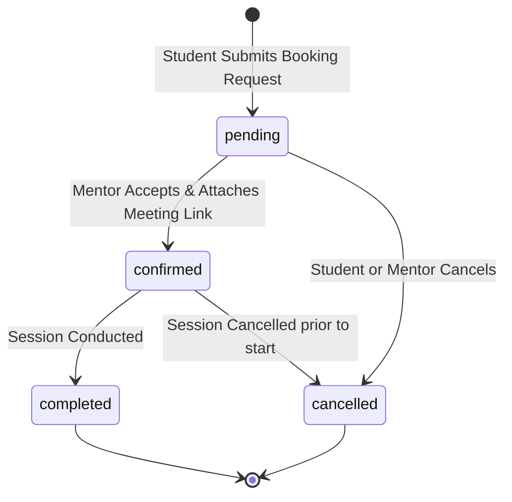

# 08. Platform Business Logic & Operational Workflows

## 1. Domain Workflow Architecture

NEXORA’s core value lies in enforcing robust business rules across slot scheduling, session booking, mentor verification, and user management. These workflows are implemented in backend services ([server/src/services/](file:///c:/Users/itzza/OneDrive/Desktop/NEXORA/server/src/services)) to guarantee domain integrity regardless of client UI state.

---

## 2. Booking State Machine & Lifecycle Transitions

Session bookings adhere to a deterministic **Finite State Machine (FSM)**:



### Transition Enforcement Matrix (`booking.service.js`)

```javascript
const ALLOWED_TRANSITIONS = {
  pending: ["confirmed", "cancelled"],
  confirmed: ["completed", "cancelled", "confirmed"],
  completed: [],
  cancelled: [],
};
```

### Invariant Rules & Security Checks:
1. **Self-Booking Prevention:** A user cannot book a session with themselves (`if (studentId === booking.mentor_id) throw Error(...)`).
2. **Slot Exclusivity:** Verifies that target `availability_slots.is_available === true` and checks `bookings` table for pre-existing records matching `availability_slot_id` (`maybeSingle()`).
3. **Atomic Slot Reservation:** Upon booking creation, `availability_slots.is_available` is immediately updated to `false`.
4. **Slot Recycling on Cancellation:** When a booking transitions to `cancelled`, `availability_slots.is_available` is set back to `true`, instantly freeing the slot for other students.
5. **Role Permission Scope:**
   - **Students:** Can only update booking state if `booking.student_id === userId` AND target state is `cancelled`.
   - **Mentors:** Can confirm, update meeting links, cancel, or mark session completed for their sessions (`booking.mentor_id === userId`).
   - **Admins:** Global override permission for all booking records.

---

## 3. Slot Creation & Overlap Prevention Logic (`availability.service.js`)

When a mentor adds a time slot:
1. **Time Bounds Validation:** Validates `start_time < end_time` and verifies minimum slot duration (e.g. 15 minutes).
2. **Overlap Querying:** Queries `availability_slots` for existing slots matching the same `mentor_id` and `day_of_week`.
3. **Temporal Intersection Check:** Ensures `newStart < existingEnd AND newEnd > existingStart`. If an intersection occurs, throws HTTP 400 Bad Request error preventing double-scheduling.

---

## 4. Mentor Verification Workflow (`admin.service.js`)

To guarantee trust across the platform, mentor profiles pass through a strict administrative gate:

```mermaid
sequenceDiagram
    actor Mentor as Unverified Mentor
    participant DB as Supabase PostgreSQL
    actor Admin as Admin User
    participant Email as Resend Email Service

    Mentor->>DB: Registers account (role: mentor, is_verified: false)
    DB-->>Admin: Profile appears in Admin Dashboard ("Pending Verification")
    Admin->>Admin: Reviews credentials, LinkedIn, experience
    
    alt Admin Approves Profile
        Admin->>DB: PATCH /api/v1/admin/mentors/:id/verify { is_verified: true, status: 'active' }
        DB->>DB: Update `users.is_verified = true`
        DB->>Email: Send "Mentor Account Verified" notification email
        Email-->>Mentor: Account active; mentor listed in public directory
    else Admin Rejects Profile
        Admin->>DB: PATCH /api/v1/admin/mentors/:id/verify { is_verified: false, status: 'rejected' }
        DB->>DB: Update `users.status = 'rejected'`
        DB->>Email: Send "Mentor Application Status Update" email
        Email-->>Mentor: Access restricted (`status = 'rejected'`)
    end
```

---

## 5. Notification Dispatch Engine (`notification.service.js` & `email.js`)

Notifications are dispatched dual-channel:

### Channel 1: In-App Persistent Notifications (`notifications` table)
- Fired synchronously inside service operations using `createNotification({ user_id, title, message })`.
- Displayed in student/mentor header notification dropdowns with live unread badge counters.

### Channel 2: Asynchronous Transactional Email Dispatches (`email.js`)
- Wraps the Resend API Node.js SDK (`new Resend(process.env.RESEND_API_KEY)`).
- Wraps email sending in non-blocking `try {...} catch (err)` blocks inside backend services:
  ```javascript
  try {
    await sendEmail({
      to: student.email,
      subject: `Booking ${status}`,
      html: `<h2>Hello ${student.full_name},</h2><p>Status: ${status}</p>`
    });
  } catch (err) {
    logger.error("Non-fatal email dispatch failure:", err);
  }
  ```
- Guaranteed non-blocking: An email provider timeout or API quota limit will never crash a database transaction or fail a user API call.
